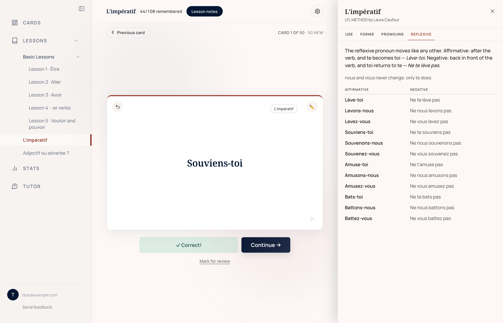
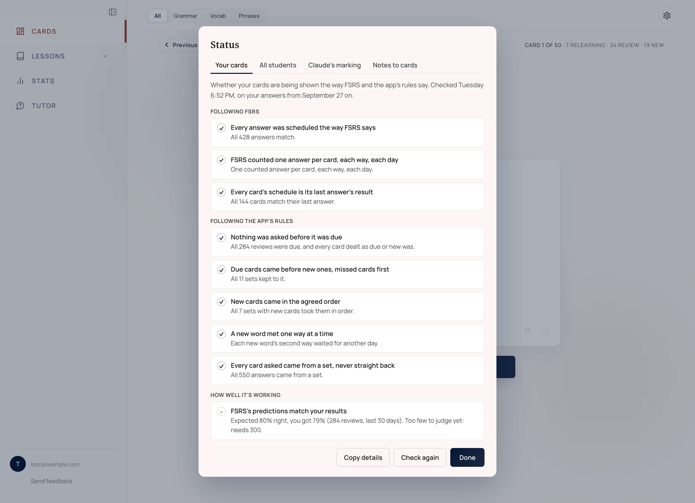
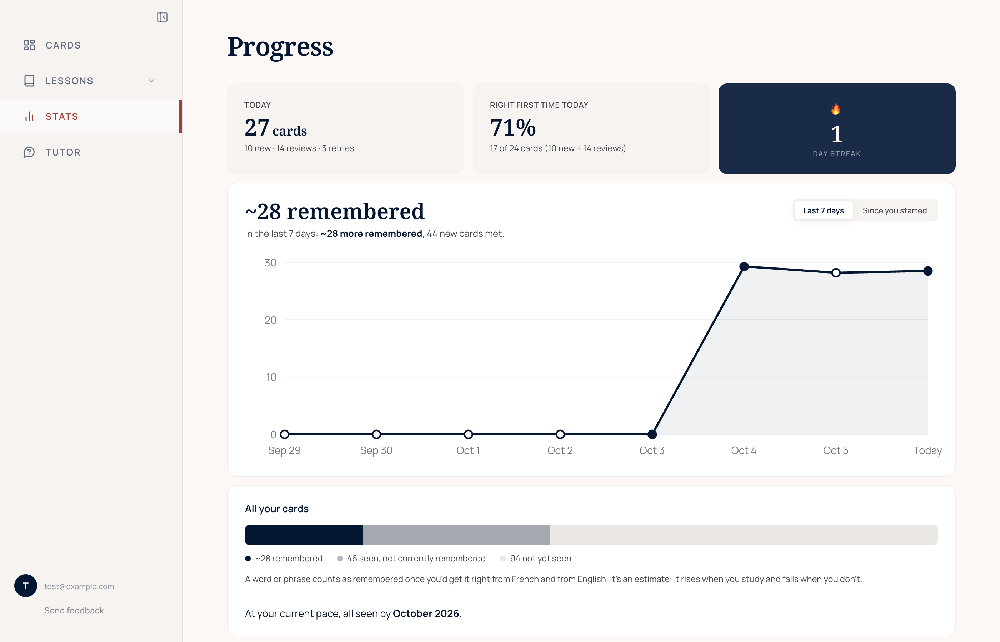

# Déjà Review

Déjà Review is a flashcard app for learning French, built around the notebook a
student keeps with their teacher. Claude reads each new class in the notebook
and turns it into flashcards. A model of memory called FSRS then decides which
cards the student sees each day, so that each word comes back shortly before it
would be forgotten.

Live at [french-flashcards-nine.vercel.app](https://french-flashcards-nine.vercel.app).

## Highlights

### Evaluation harness

Every morning the server runs eleven checks on every student's record of
answers and their deck. They confirm that each answer was scheduled the way
FSRS says, that no card came up before it was due, that missed cards came back
first and new cards arrived in the agreed order, that FSRS's predictions match
how often students are actually right, that no card is in a deck twice, and
that nothing a student deleted or corrected has come back.

Claude's own work is tested too. Its marking of disputed answers is checked
against the decisions of the app's owner, who runs it and studies with it, its
reading of class notes against the owner's corrections to the cards it made,
and its judging of whether two look-alike cards are the same card against
repeats the owner put away and pairs that must stay apart. Before any change
to scheduling, simulated students study for six months with the app's own
code, including messy ones who reload mid-set or wander off into a lesson. And
39 test suites run on GitHub on every push.
[Evaluation harness](docs/evaluation-harness.md)

### Cards from class notes

A student links the Google Doc their notebook is kept in, and each new class
becomes cards within a day, without anyone pressing anything. Each line of
the notes is read once, however they come in, so uploading an updated notebook
adds only what is new, and a word taught again keeps its card and gains the
new date. Only what can be answered by typing becomes a card: a
conjugation table becomes one drill per form, and a grammar rule makes no card
at all. [How class notes become cards](docs/cards-from-notes.md)

### Scheduling fitted to each student

Each word has two schedules, one from French and one from English, because
recognising a word and producing it are different skills. Once a student has
given about 1,000 answers, FSRS is fitted to how that student forgets, and the
fitted version is used only if it predicts their newest answers better than
the settings already in use. The study day runs from 4am to 4am in the
student's own time zone, so a late session counts as one day.
[How cards are scheduled](docs/scheduling.md)

### Marking typed answers

A small typo is forgiven, but the wrong gender on an article is not. A
conjugation drill must be exact, because typo tolerance would accept the very
mistake being drilled, such as "je vend" for *je vends*. A student who thinks
a mark is wrong can ask Claude to judge it, and an answer Claude accepts is
accepted for that student from then on.
[Where Claude is used](docs/where-claude-is-used.md)

### Lessons

There are seven built-in lessons, six of them from Laura Caufour's LFL METHOD
course, each with notes that sit beside the card while the student answers.
The five beginner lessons come up in daily cards from the start, and each
student chooses which of the others to add.

### Feedback reviewed by Claude

A student can report a bad card or a problem from the card itself or the
sidebar. Claude reviews each report and proposes what to do: a corrected card,
removing the card, or a brief for fixing the app. The owner applies a fix with
one click, and can undo it.

### Progress

Every number on the Stats page says what it counts, such as "37 of 50 cards".
"Remembered" is FSRS's estimate of how many cards the student would get right
today, so it falls when they stop studying, and a word counts only when it is
known both ways round.

## How it's built

- React 18 and Vite, with no router and no CSS framework.
- Supabase: Postgres with row-level security, and sign-in by emailed link.
- Vercel: 11 server functions, one fewer than its free plan allows, and four
  scheduled runs a day.
- Claude, called only from the server: Haiku 4.5 reads class notes; Opus 5
  judges disputed marks; Opus 5.5 reviews feedback, settles look-alike cards,
  and writes and marks the listening questions in Podcasts, which only the
  owner has so far; and Sonnet 5 is the tutor.
- ts-fsrs for scheduling, and the FSRS team's optimizer for fitting each
  student's settings.
- Playwright driving headless Chromium for the browser tests, and GitHub
  Actions running every test on each push.

## Built with Claude Code

The app is built with Claude Code. Each working session starts from the
[working notes](french%20flashcards%20context.md), which describe the app as it
is, record each of the owner's decisions with its date and reason, and list
what is still open. They are updated with every change. How a lesson is made is
written down as a [skill](.claude/skills/building-lessons/SKILL.md) that Claude
follows.

## More

- [Evaluation harness](docs/evaluation-harness.md)
- [How cards are scheduled](docs/scheduling.md)
- [How class notes become cards](docs/cards-from-notes.md)
- [Where Claude is used, and who pays](docs/where-claude-is-used.md)
- [Running your own copy](docs/setup.md)
- [The tests guide](tests/README.md): every test suite, and what each checks
- [The working notes](french%20flashcards%20context.md): the full design
  history
