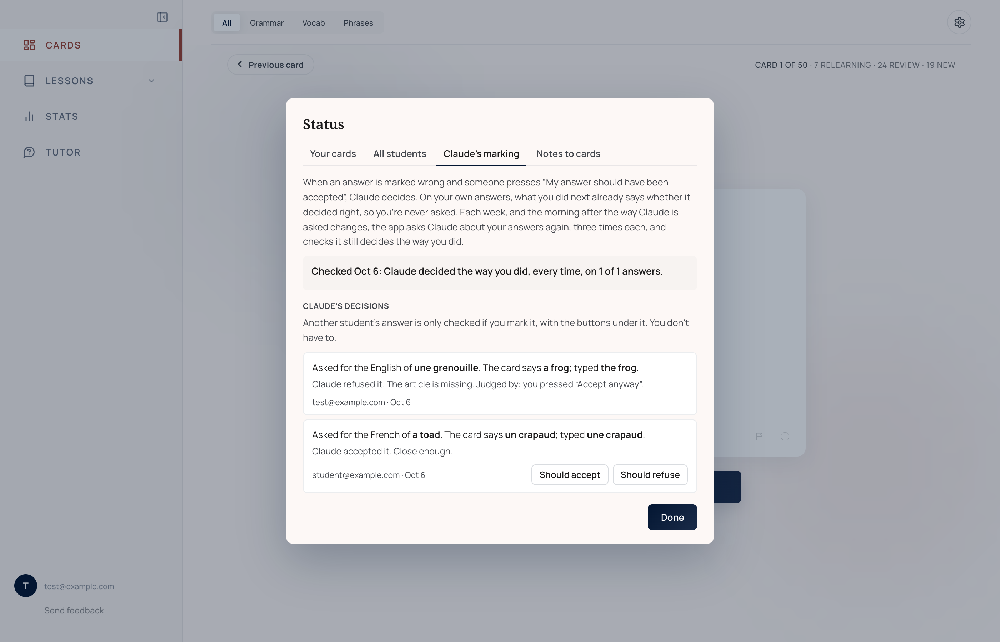

# Evaluation harness

A flashcard app can go wrong without anyone noticing. If a card comes up a day
early, a missed word fails to come back first, or a schedule is saved from the
wrong answer, the student still just sees cards, and nothing looks broken. So
Déjà Review checks its own work in four ways:

1. **The status check**: nine checks on every student's real record of
   answers, run every morning.
2. **Tests of Claude's work**: its marking of disputed answers and its reading
   of class notes, each tested against decisions the owner (who runs the app
   and studies with it) has already made.
3. **Simulated students**, who study for six months with the app's own code,
   including messy ones who reload and wander off mid-set.
4. **34 test suites**, run on GitHub on every push.

## The status check

The status check asks three questions about the cards each student was shown.
Were they shown when FSRS said they should be? (FSRS is the model of memory
that schedules the cards; see [How cards are scheduled](scheduling.md).) Were
they shown the way the app's own rules say? And are FSRS's predictions coming
true?

The app keeps two records so these questions can be answered. Every answer is
saved with the settings it was scheduled with, so its schedule can be worked
out again exactly, even on a day the settings changed. And every set of cards
the app deals is saved with what the app believed about each card at that
moment: due, new, or missed last time. Neither record can delay or lose an
answer.

The nine checks, as the Status window names them:

**Following FSRS**

1. *Every answer was scheduled the way FSRS says.* Each answer is replayed
   through FSRS. The stored memory estimates must match to four figures, and
   the gap must fall within FSRS's usual random spread.
2. *FSRS counted one answer per card, each way, each day.* Only the day's first
   answer may move a schedule. A retry later in the set is practice.
3. *Every card's schedule is its last answer's result.*

**Following the app's rules**

4. *Nothing was asked before it was due.*
5. *Due cards came before new ones, missed cards first.*
6. *New cards came in the agreed order.* The rules are written out again inside
   the check rather than borrowed from the code that deals the cards, so a
   mistake in that code can't hide in its own check.
7. *A new word met one way at a time.* A word's French-to-English and
   English-to-French questions are never both new on the same day.
8. *Every card asked came from a set, never straight back.*

**How well it's working**

9. *FSRS's predictions match your results.* Over the last 30 days, answers are
   grouped by the chance FSRS gave them of being right. A group fails if its
   real share right is 10 points off once it holds 100 answers, and all the
   answers together fail at 5 points off once there are 300.

The checks are one file, used in three places:

- **In the app**, for the owner. "Status" in the profile menu opens a window
  that marks each check passed, failed or waiting, and names the cards behind
  any failure. A red dot on the avatar means something needs a look. "Copy
  details" copies the report, ready to paste into a Claude session.
- **On the server, every morning**, for every student who has answered a card.
  The reports are kept, and a failed check for any student lights the same red
  dot. The Status window's "All students" tab shows them.
- **In the terminal**, as a script that runs the checks on any student's live
  record and only reads.

The checks were tuned on real data so that they don't raise false alarms. When
they first ran on the owner's own record, three failed, and none of the
failures had touched a card the owner answered. Each came from ordinary
messiness. In one, the app opened with the browser's out-of-date copy of the
deck, dealt a set from it, and replaced that set twelve seconds later when the
fresh copy arrived. In another, a class's notes arrived seconds after a set was
dealt. The checks were changed so that a set replaced before any of it was
answered isn't judged, and a class date counts only once its notes had arrived.

## Testing Claude's work

Claude makes two judgments in the app that change what students learn: whether
an answer the app marked wrong should have been accepted, and which cards a
class's notes should become. Both are tested against what the owner has
already done in the app, so nobody has to sit down and label examples.

### Marking disputed answers

When the app marks a typed answer wrong, the student can press "My answer
should be accepted", and Claude decides. Every verdict is saved, accepted or
not, with both sides of the card, what was typed and Claude's reason.

What Claude should have said is read from what the owner did next. If Claude
refused and the owner pressed "Accept anyway", the refusal was wrong. If Claude
refused and the owner moved on, it was right. If Claude accepted and the owner
let it stand, that was right. Another student's disputes count only once the
owner has marked them in the Status window.

The test asks Claude again about every answer whose right verdict is known,
three times each, with the same question and the same model the app uses. Each case comes out
pass, mixed, fail (wrong more often than right) or untried (no usable answer).

### Reading class notes

Every card the owner fixes or deletes is logged, and each correction becomes a
test case. The test finds the class the card came from in the linked notebook
and has Claude read that class again, three times, exactly as the morning
reading does. Then it checks whether the mistake the owner corrected comes
back: the same stray English on the French side, the same note left on the
back of a card, or a deleted card made again in other words. When the test was
first built, the owner's 48 corrections made 46 cases (two edits had changed
nothing), and the class behind every one of them was found.

### When the tests run, and when they warn

Both tests run by themselves on the server: once a week, and at the next
scheduled run after the question Claude is asked changes. Each version of the question has a
fingerprint, made from its wording and the model, and for the notes test from
all the code that turns Claude's reply into cards. Results are kept per
version, so a new version can be compared with the last. There is no button to
press.

The red dot lights only when a case that passed before a change of version
fails after it. Claude can answer the same question differently from one run
to the next, and a review of the first design found that a few borderline
cases would have lit the warning most weeks by chance. Cases Claude gets wrong
are still listed in the Status window either way.

## Simulated students

A simulated student studies with the app's own code for 180 days. The app deals
its sets, schedules its answers and records them in the same shape as the real
tables, and the status check runs on the result. The simulated student's
memory deliberately doesn't work the way FSRS assumes, so FSRS isn't graded
against its own assumptions. `npm run simulate` runs weak and typical students
through every check in a few seconds, and it is run before any change to
scheduling.

Messy students do what real ones do. On some days the app deals from the
browser's old copy of the deck and deals again seconds later, a class's notes
arrive partway through a set, the page is reloaded mid-set, or the student
goes into a lesson and comes back. These are the events behind the three false
alarms on the owner's record, and the checks as they were before the fix fail
every messy run with those same three alarms. So the simulation reproduces
what happened in real use. The first messy run also found a bug that is still
open: after a detour into a lesson, a card just answered there can be asked
again in the set the student returns to.

`npm run simulate:compare` compares the four "How much to remember" settings
(see [How cards are scheduled](scheduling.md#how-much-to-remember)). The
highest, 95%, was never the best choice: it cost typical and strong students 17
to 26% more study time for each card remembered. Among the other three, the
best choice depended on the student, so Automatic stays the default.

## The test suites

`npm test` runs 34 suites. Sixteen need no browser. They cover the rules for
dealing and scheduling, the study day, the status check itself, and most of the
server functions, with stand-ins for the database and for Claude, so nothing
leaves the machine. One of them checks that a caller without a verified sign-in
can't cause a single request to Claude. The other eighteen drive the real app
in headless Chromium against a mock database.

The browser suites measure what a student would see, rather than trusting what
the code intends: where the card sits at seven window heights, how far it moves
in each animation frame while a panel opens, and exactly what each answer
writes to the database. The stand-in database refuses what the real one
refuses, because a more lenient stand-in twice let through a write that then
failed on the live app.

Every push to GitHub runs the build, the simulated students and all 34 suites,
in about nine minutes. A failure marks the commit with a red cross. A browser
suite that fails gets one second try, and the summary names any suite that
needed it, so a suite that fails now and then still gets noticed.

The [tests guide](../tests/README.md) describes every suite, and five rules for
writing checks, each learned from a check that passed when it should have
failed.

## In the code

- `src/lib/statusChecks.js`: the nine checks, shared by the app, the script and
  the simulations
- `src/StatusModal.jsx`: the Status window
- `api/_lib/statusDaily.js`: the morning run for every student
- `api/_lib/answerChecks.js` and `api/_lib/notesChecks.js`: the tests of
  Claude's marking and note reading; `api/_lib/evalRuns.js` decides when they
  are due, and `api/_lib/evalStatus.js` when the red dot lights
- `scripts/status-check.mjs`: the checks from the terminal
- `tests/simulate/`: the simulated students
- `.github/workflows/tests.yml`: the tests on every push
