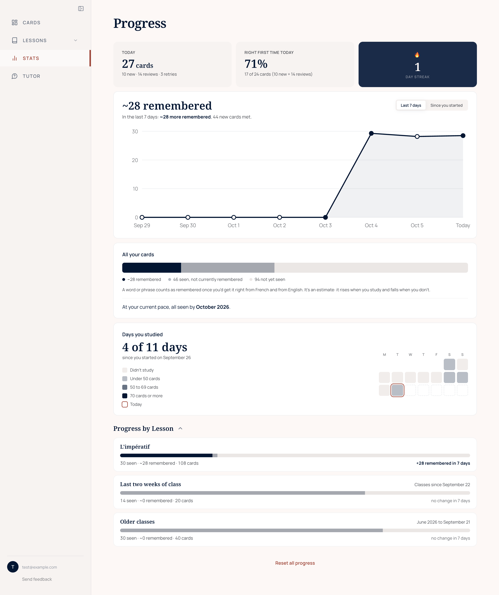

# How cards are scheduled

Déjà Review schedules cards with FSRS, the Free Spaced Repetition Scheduler,
through the [ts-fsrs](https://www.npmjs.com/package/ts-fsrs) library. FSRS keeps
an estimate of how well each card is known, and from it predicts the chance of
remembering the card on any later day. A card comes back on the day that chance
falls to the student's target, 90% unless they choose otherwise. A right
answer strengthens the estimate, so the gaps keep growing. A miss shortens the
gap rather than sending the card back to the start.

This page covers how the app uses FSRS, and the rules it adds on top.

## Each way round has its own schedule

A word or phrase can be asked from French ("la pomme → ?") or from English
("apple → ?"). Each way round has its own schedule, because recognising a word
and producing it are different skills, and which is harder differs from one
student and one word to the next. Neither way waits for the other.

One rule links them: a word's two first meetings are kept apart. Once a word
has been asked one way for the first time, the other way waits for a later
day, so the second question doesn't come straight after the student has seen
the answer. Grammar cards are asked one way only, as written.

The student can study from French, from English, or both mixed.

## Right or wrong, and nothing else

FSRS was designed for four buttons: Again, Hard, Good and Easy. This app only
records whether the answer was right, either typed correctly or, when flipping
cards, "Got It". Right is recorded as Good and wrong as Again. Nothing is
guessed from typing speed or typos. Two things were changed so that FSRS works
well with two grades:

- The starting settings were fitted to right-or-wrong answers from the FSRS
  team's open data set, counting Hard and Easy as right. The library's own
  defaults assume four buttons.
- The gap after an answer comes straight from the card's own estimate. The
  library keeps the four buttons' gaps in order, Good at least a day after
  Hard, which made every right answer wait at least three days however shaky
  the card was.

## One answer a day counts

FSRS gets one answer per card, each way round, per day: the first. A missed
card comes back later in the same set as a retry, but the student has just
seen the answer, so the retry says nothing about memory from one day to the
next. It is practice, and the same goes for a second set later that day, a
reload, or another computer. Every answer is still kept in the record.

## The study day runs from 4am to 4am

A session that runs past midnight counts as one day, in the student's own time
zone, as in Anki. FSRS counts the days between answers the same way. On its
own, the library counts days by the date in UTC, which changes at 8pm in New
York, so an answer at 9pm and another the next morning were "0 days apart" and
the second earned nothing. The app now gives the library times whose UTC date
is the student's own day.

## Each student's own settings

FSRS describes how a person forgets with 21 numbers, and every student starts
on the same ones. Once a student has given about 1,000 answers that FSRS
counted, the server fits new numbers to their answers with the FSRS team's own
optimizer. It fits on the older 80% of the answers and tests the result on the
newest 20%, which it hasn't seen. Only if the fit predicts those better than
the numbers in use does the student get a fit made on all their answers. It
tries again after 500 more answers and 30 days. On the FSRS team's open data, a
personal fit beat the starting settings for 78% of users at 1,000 answers. At
250 answers it was a coin flip.

When the numbers change, the server works out each card's memory estimate again
from its own answers. No due date moves, and a card answered in the meantime is
left alone.

## How much to remember

The student sets their target under "How much to remember" in the profile
menu: Lighter load (85%), Standard (90%), Remember more (95%), or Automatic,
which is the default. Automatic starts at 90%. When the student has started 5
of their last 7 study days with due cards left over from before, it drops two
points, but never below 85%. When they are keeping up again, it rises. It moves
at most once a week. A higher target means more reviews each day in return for
remembering more. A simulation of the four choices found that 95% was never the
best use of a student's time ([details](evaluation-harness.md#simulated-students)).

## What goes into a set

Cards are studied in sets of 50, or 20, 30 or 100 if the student prefers. A set
is filled in this order:

1. Cards missed last time that are due today.
2. Other cards due today, the most overdue first.
3. New cards, but only once the due cards have run out.

There is no daily limit on new cards. When reviews pile up, new cards wait,
which is exactly when they should. And no card is ever shown before it is due,
however well it is known.

New cards come in a fixed order. In a lesson they follow the lesson's teaching
order. Otherwise they come from the last two weeks of classes first, newest
class first, then from older classes, starting with the words that came up in
the most classes, and lesson cards come after the student's own. A card the
student added themselves, from the tutor or, for the owner so far, from a
podcast passage, came up in no class, so it counts as if from a class on the
day it was added: one added today is among the newest. The set is
then shuffled, because practising one kind of
card in a run feels easier at the time but is remembered worse afterwards.

A missed card comes back as a retry 20 cards later. It takes the place of the
set's last card, which moves to the next set, so a set never grows.

The set on screen is saved in the browser as it changes. A reload, which is how
every update reaches a student, puts them back on the same card, with the same
count and the same retries waiting. Choosing a different number of cards
changes the set on screen at once: the card on screen, every answer and the
retries waiting all stay, and only the cards not yet reached are added or
taken away.

## How progress is counted

The app never calls a card "mastered". It shows three figures: cards seen,
about how many are remembered, and cards not yet seen. "Remembered" adds up
each card's chance of being remembered right now, as FSRS estimates it, so it
rises with study and falls without it. A word counts only as well as it is
known both ways round: its chance is the chance from French times the chance
from English. A card whose last answer was wrong counts for nothing until it is
answered right again.

On the Stats page every number says what it counts, such as "37 of 50 cards"
or "+12 remembered in 7 days", and figures shown side by side add up.

## Before FSRS

The app started with a fixed ladder of boxes (the Leitner system). It had three
problems. The gaps stopped growing at 21 days, so a word known cold for a year
still came back every three weeks. A right answer earned the same whether it
came on time or a month late. And one miss sent a card back to the first box.
When the app switched to FSRS, each card's real history came with it.

## In the code

- `src/lib/sessionQueue.js`: what goes into a set, and in what order
- `src/lib/spacedRepetition.js`: scheduling an answer
- `src/lib/studyDay.js`: the 4am day
- `src/lib/fsrsSettings.js` and `api/fsrs-fit.js`: each student's own settings
- `src/lib/progress.js`: seen, remembered and not yet seen
- `src/lib/studyPlace.js`: the set on screen, kept through a reload
